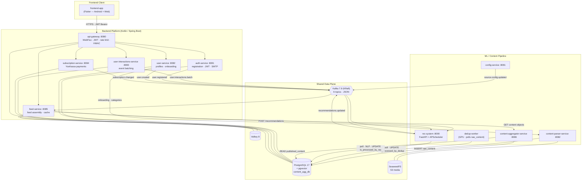

# SKD — Content Aggregation & Personalized Feed Platform

**SKD** is a full-stack content aggregation platform that ingests posts from external
sources (Telegram channels, web feeds), deduplicates them, enriches them with NLP
features, builds per-user interest profiles, and serves a personalized feed to a
Flutter client.

The platform is composed of **five independent subsystems** that share a single
PostgreSQL database (`content_agg_db`) with strict schema separation. Each subsystem
lives in its own Git repository and is developed independently; this repository
(`SKD`) is the **orchestration root** — it holds the cross-service architecture,
infrastructure manifests, integration specs, and end-to-end test tooling that tie
the subsystems together.

---

## Table of Contents

- [System Overview](#system-overview)
- [Architecture](#architecture)
- [Subsystems](#subsystems)
- [Data Flow](#data-flow)
- [Database Ownership](#database-ownership)
- [Messaging (Kafka Topics)](#messaging-kafka-topics)
- [Repository Layout](#repository-layout)
- [Infrastructure & Deployment](#infrastructure--deployment)
- [End-to-End Testing](#end-to-end-testing)
- [Development Model](#development-model)
- [Technology Stack](#technology-stack)

---

## System Overview

| # | Subsystem | Language / Stack | Responsibility |
|---|-----------|------------------|----------------|
| 1 | **content-aggregation-system** | Kotlin, Spring Boot 3.4 | Source configuration, parsing external content, publishing aggregated content via REST |
| 2 | **dedup-system** | Python 3.12 | GPU worker: near-duplicate detection over embeddings, similarity graph |
| 3 | **rec-system** | Python 3.12, FastAPI | NLP feature extraction, user interest profiles, feed ranking & personalization |
| 4 | **backend** | Kotlin, Spring Boot 3.4 (6 microservices) | API gateway, auth, user profiles, interaction capture, subscriptions, feed assembly |
| 5 | **frontend-app** | Dart 3, Flutter 3 | Android + Web client — auth, onboarding, personalized feed, collections, profile |

**Shared data plane:** PostgreSQL 17 (+ pgvector), Valkey 8, Kafka 7.9 (KRaft),
SeaweedFS (S3-compatible media storage).

---

## Architecture



### Key architectural rules

1. **The Flutter client talks only to `api-gateway :8080`.** No direct service calls.
   All contracts are documented in `frontend-app/API_CONTRACTS.md`.
2. **Each subsystem writes only to its own tables.** Cross-system interaction is
   either a flag `UPDATE` or a read-only `SELECT` (see [Database Ownership](#database-ownership)).
3. **No Kafka schema changes without updating every consumer.** Topics are versioned.
4. **A single user UUID** flows through the whole system: `auth → JWT → X-User-Id → all services`.
5. **All backend services verify an HMAC `X-Gateway-Signature`** — internal services
   are never exposed directly.
6. **Transactional outbox** for Kafka publication in `auth`, `user`, and `subscription` services.

---

## Subsystems

### 1. content-aggregation-system (Kotlin / Spring Boot)

Three services:

| Service | Port | Role |
|---------|------|------|
| config-service | 8081 | CRUD for content sources; emits `source.config.updated` |
| content-parser-service | 8082 | Parses Telegram / web sources, writes `data_flow.raw_content`, stores media in SeaweedFS |
| content-aggregator-service | 8086 | Read-only REST API over `data_flow.published_content` |

- DB schemas: `config`, `data_flow`
- Messaging: Kafka (Protobuf) — `source.config.updated` only
- Migrations: Liquibase (formatted SQL)

### 2. dedup-system (Python)

A single GPU worker (no HTTP surface). Polls `data_flow.raw_content`, runs a
deduplication pipeline, and maintains a similarity graph.

- Embeddings: **BGE-M3 FP16, 1024-dim** (pgvector)
- SHA-256 exact-hash dedup + threshold classifier (`EXACT` / `DUPLICATE` / `RELATED`)
- Tables owned: `articles`, `similarities`, `dedup_config`, `batch_seq`
- Sets `raw_content.is_processed_by_dedup = true`
- ~180 unit + integration tests (Testcontainers)
- Package manager: `uv`

### 3. rec-system (Python / FastAPI)

Feature extraction, user interest profiling, and feed ranking.

- API: FastAPI `:8000` + APScheduler background jobs
- Embeddings: **rubert-tiny2, 312-dim** (pgvector); topic (rubert-nli), sentiment
  (rubert-sentiment), NER (spaCy)
- Tables owned: `posts_features`, `rec_profiles`, `rec_entity_interests`, `rec_config`
- Reads dedup graph (`articles` + `similarities`) to exclude `EXACT`/`DUPLICATE`
  content and space out `RELATED` posts in the feed
- Sets `raw_content.is_processed_by_rec = true`
- `POST /recommendations?include_breakdown=true` returns per-item score components,
  latency breakdown, profile snapshot, and feature flags for training-data capture
- `/metrics` (Prometheus): feed request counter + latency / content-processing histograms
- ~450 unit tests + integration/e2e (Testcontainers)
- Package manager: `uv`

### 4. backend (Kotlin / Spring Boot — 6 microservices)

`Controller → Processor → Service → Repository` layering (api-gateway is a WebFlux
filter pipeline).

| Service | Port | Schema | Produces | Consumes | HTTP out |
|---------|------|--------|----------|----------|----------|
| api-gateway | 8080 | — | — | — | proxies all |
| auth-service | 8081 | `auth` | `user.registered` | `subscription.changed` | SMTP |
| user-service | 8082 | `users` | `user.created` | `user.registered`, `subscription.changed` | rec-system |
| user-interactions-service | 8083 | `interactions` | `user.interactions.batch` | — | — |
| subscription-service | 8084 | `subscription` | `subscription.changed` | — | YooKassa |
| feed-service | 8085 | `feed` | — | `recommendations.updated` | rec-system, content-aggregator |

- Cache: Valkey 8 (gateway: token revocation + rate limiting; feed-service: feed/content cache)
- Migrations: Liquibase — auto-applied at startup (`liquibase-core` runtime) with
  standalone Docker/K8s jobs as fallback
- All services expose `/actuator/prometheus` with custom meters
- Strict Navigator/Driver TDD (JUnit 5 + MockK + Testcontainers + AssertJ)

### 5. frontend-app (Flutter)

- Dart 3 / Flutter 3, Clean Architecture (Presentation → Domain → Data)
- State: Riverpod 2 (`NotifierProvider`, `AsyncNotifierProvider`)
- Networking: Dio with `AuthTokenInterceptor` + `RefreshTokenInterceptor`
- Storage: `flutter_secure_storage` (JWT — 15 min access / 30 day refresh)
- Features: registration + email verification, login, onboarding (3–5 topics),
  personalized feed with pagination, collections (bookmarks / likes / dislikes),
  profile, interaction tracking (batched `POST /api/interactions/batch`)

---

## Data Flow

**Content ingestion → publication**

```
config-service ──(source.config.updated)──▶ content-parser-service
content-parser-service ──INSERT──▶ data_flow.raw_content
        │
        ├──▶ dedup-worker   polls, runs dedup,  sets is_processed_by_dedup = true
        └──▶ rec-worker      polls, runs NLP,    sets is_processed_by_rec   = true
        │
        ▼  (PublishContentJob — requires BOTH flags true)
data_flow.published_content ──▶ content-aggregator-service (REST)
```

**Feed request (personalized)**

```
frontend-app ──GET /api/feed──▶ api-gateway ──▶ feed-service
feed-service ──POST /recommendations?include_breakdown=true──▶ rec-system
        rec-system ranks published_content by rec_profiles + posts_features,
        excludes EXACT/DUPLICATE, spaces RELATED, returns published_content.id + score breakdown
feed-service ──GET content objects──▶ content-aggregator-service
feed-service ──persist feed_requests + feed_items (async)──▶ feed schema
        response carries X-Request-Id + X-Feed-Source headers
```

**Interaction capture (feeds the recommender loop)**

```
frontend-app ──POST /api/interactions/batch──▶ api-gateway ──▶ user-interactions-service
user-interactions-service ──persist (monthly-partitioned)──▶ interactions.user_interactions
user-interactions-service ──(user.interactions.batch v2)──▶ Kafka ──▶ rec-system
        rec-system updates rec_profiles / rec_entity_interests
```

Canonical interaction vocabulary (6 values, shared across backend enum, rec-system
classifier, and frontend enum):
`IMPRESSION · OPEN · CLOSE · LIKE · DISLIKE · BOOKMARK`
(legacy names `VIEW/CLICK/SCROLL_PAST/SAVE/HIDE/SHARE` are accepted and mapped on ingest).

---

## Database Ownership

Single database `content_agg_db`. **Each system writes only to its own tables.**

### ML / Content Pipeline — schema `data_flow`

| Owner | Tables (write) | Cross-system access |
|-------|----------------|---------------------|
| parser-service | `parser_tasks`, `raw_content`, `published_content` | — |
| dedup-worker | `articles`, `similarities`, `dedup_config`, `batch_seq` | `UPDATE raw_content.is_processed_by_dedup` |
| rec-worker | `posts_features`, `rec_profiles`, `rec_entity_interests`, `rec_config` | `UPDATE raw_content.is_processed_by_rec`; READ `articles`, `similarities`, `published_content` |
| aggregator-service | — | READ `published_content` |

Schema `config` is owned by config-service (`sources`).

### Backend Platform — schema per service

| Schema | Owner | Tables |
|--------|-------|--------|
| `auth` | auth-service | `users`, `email_verification_tokens`, `password_reset_tokens`, `refresh_tokens`, `outbox` |
| `users` | user-service | `profiles`, `outbox` |
| `interactions` | user-interactions-service | `user_interactions` (monthly partitioned) |
| `subscription` | subscription-service | `plans`, `subscriptions`, `payments`, `saved_payment_methods`, `webhook_log`, `outbox` |
| `feed` | feed-service | `user_bookmarks`, `user_likes`, `user_dislikes`, `feed_requests`, `feed_items` |

**No cross-schema access between backend services.**

---

## Messaging (Kafka Topics)

Kafka 7.9 in KRaft mode (no Zookeeper). Backend topics use JSON serialization; the
content pipeline uses Protobuf.

| Topic | Producer | Consumer(s) | Version |
|-------|----------|-------------|---------|
| `user.registered` | auth-service | user-service | v1 |
| `user.created` | user-service | rec-system | v1 |
| `user.interactions.batch` | user-interactions-service | rec-system | **v2** (adds optional `feed_request_id`, `position_in_feed`, `device_type`, `app_version`, `ab_bucket`, `scroll_depth`, `metadata` — backward compatible) |
| `subscription.changed` | subscription-service | auth-service, user-service | v1 |
| `recommendations.updated` | rec-system | feed-service | v1 |
| `content.published` | parser-service | dedup-system | v1 |
| `source.config.updated` | config-service | content-parser-service | v1 (Protobuf) |

> The legacy `content.parsed` topic was removed — that data now flows through the
> shared `data_flow` schema.

---

## Repository Layout

```
SKD/
├── backend/                       # Kotlin microservices (own .git; only design/ + build scripts tracked here)
│   ├── api-gateway/  auth-service/  user-service/
│   ├── user-interactions-service/  subscription-service/  feed-service/
│   └── design/                    # design-driven-development specs
├── content-aggregation-system/    # Kotlin content pipeline        (own .git — git-ignored here)
├── dedup-system/                  # Python dedup worker            (own .git — git-ignored here)
├── rec-system/                    # Python FastAPI recommender     (own .git — git-ignored here)
├── frontend-app/                  # Flutter client                 (own .git — git-ignored here)
│
├── infrastructure/
│   ├── k8s/
│   │   ├── base/                  # postgres, kafka, seaweedfs, valkey, nodeports
│   │   ├── backend/               # api-gateway, services, yookassa-proxy
│   │   ├── content-agg/           # config-service, parser (web + tg), aggregator
│   │   └── ml/                    # dedup + rec alembic jobs & workers
│   ├── gateway/                   # unified gateway config
│   ├── postgres/                  # init-all.sh (schema bootstrap)
│   ├── seaweedfs/                 # S3 config
│   └── yookassa-proxy/            # nginx egress proxy for YooKassa
│
├── scripts/
│   ├── add-sources.sh             # seed content sources
│   ├── apply-backend-migrations.sh
│   ├── e2e_data_capture_test.sh   # end-to-end acceptance test
│   └── hnsw_demo/                 # pgvector HNSW index benchmark (SQL + RESULTS.md)
│
├── docker-compose.yml             # full stack (infra + all services)
├── docker-compose.ml.yml          # ML pipeline + k3d hybrid deployment
├── docker-compose.smoke.yml       # minimal smoke-test stack
├── data-capture-spec.md           # cross-service integration spec
├── links.json                     # inter-service URL registry
└── rec_playground.ipynb           # recommender experimentation notebook
```

> The five subsystem directories each contain a standalone Git repository and are
> **git-ignored** in this root repo. Clone / pull them individually.

---

## Infrastructure & Deployment

### Local — Docker Compose (full stack)

```bash
# Bring up infrastructure + migrations + all 11 services
docker compose up -d

# ML pipeline only (dedup + rec workers, alembic jobs, optional k3d)
docker compose -f docker-compose.ml.yml up -d

# Minimal smoke stack
docker compose -f docker-compose.smoke.yml up -d
```

Compose brings up, in dependency order:

1. **Infra:** `postgres`, `valkey`, `kafka`, `seaweedfs` (+ `seaweedfs-init`)
2. **Migrations:** Liquibase containers (`*-liquibase`) + Alembic jobs
   (`dedup-alembic`, `rec-alembic`) — run to completion before apps start
3. **Services:** content pipeline (`config`, `parser`, `aggregator`), workers
   (`dedup-worker`, `rec-worker`), backend (`auth`, `user`, `interactions`,
   `subscription`, `feed`, `api-gateway`), plus `yookassa-proxy`

### Kubernetes (k3d / k3s)

Manifests under `infrastructure/k8s/`, applied by layer:

```bash
kubectl apply -f infrastructure/k8s/00-namespace.yaml
kubectl apply -f infrastructure/k8s/base/          # datastores
kubectl apply -f infrastructure/k8s/ml/            # dedup + rec (alembic jobs first)
kubectl apply -f infrastructure/k8s/content-agg/   # config, parser, aggregator
kubectl apply -f infrastructure/k8s/backend/       # gateway, services, proxy
```

Backend DB migrations run as Kubernetes Jobs (`liquibase`) gated by
`service_completed_successfully` semantics; app pods also self-apply Liquibase at
startup as a safety net.

### Observability

- **Structured JSON logs** across all 7 runtime services
  (logstash-logback-encoder for Kotlin, python-json-logger for Python) with
  `request_id` + `user_id` from MDC / contextvars.
- **Prometheus** — every Kotlin service exposes `/actuator/prometheus`;
  rec-system exposes `/metrics`.
- **Health** — backend `GET /health` → `{status, service, checks: {database, redis, kafka}}`;
  feed-service `/actuator/health` includes custom rec-system + feed-schema indicators.
- **Request tracing** — `api-gateway` mints an `X-Request-Id` per request and
  propagates it (via HMAC payload + downstream headers) end to end.

---

## End-to-End Testing

`scripts/e2e_data_capture_test.sh` is the acceptance test for the data-capture
pipeline. It:

- auto-manages `kubectl port-forward` for the services under test
- registers a user and **auto-verifies the email** token
- drives a full feed request → interaction batch → recommender-update cycle
- asserts persistence of `feed_requests` / `feed_items` (incl. `scoring_components`),
  canonical `LIKE` `action_type`, `scroll_depth`, and `metadata`
- joins against the `subscription` schema to assert payment-path persistence
- cleans up via a trap on exit

```bash
./scripts/e2e_data_capture_test.sh
```

---

## Development Model

This root repository is an **orchestration workspace**, not an application project —
no application code is written here. Cross-service work follows a research → design →
plan → delegate → validate → review pipeline; implementation is delegated to each
subsystem's own repository, where that project's conventions, tests, and TDD
protocol apply.

| Subsystem | Dev protocol | Tests |
|-----------|--------------|-------|
| frontend-app | Clean Architecture + Riverpod | widget + unit tests |
| content-aggregation-system | Spring Boot service pattern | JUnit (partial coverage) |
| dedup-system | autonomous TDD (RED → GREEN → REFACTOR) | ~180 cases, Testcontainers |
| rec-system | autonomous TDD (RED → GREEN → REFACTOR) | ~450 cases, Testcontainers |
| backend | design-driven + Navigator/Driver TDD | JUnit 5 + MockK + Testcontainers |

Delivered cross-service milestones are tracked in `data-capture-spec.md` and the
per-project reports. Highlights:

- **Data Capture Foundation** — request-id propagation, feed-request / feed-item
  persistence, score-breakdown capture, structured logging, Prometheus metrics.
- **MVP Hardening** — canonical `ActionType` vocabulary, `scroll_depth` + `metadata`
  persistence, cached-feed score retention, real API repositories in the Flutter
  client, `/actuator/prometheus` on all Kotlin services, auto-applied Liquibase,
  rec-system `rec_config` TTL cache.

---

## Technology Stack

| Layer | Technology |
|-------|------------|
| Client | Dart 3, Flutter 3, Riverpod 2, Dio, flutter_secure_storage |
| Backend services | Kotlin 2.1.20 (JVM 25), Spring Boot 3.4.5, Spring WebFlux (gateway), Gradle Kotlin DSL |
| Content pipeline | Kotlin 2.1.20, Spring Boot 3.4.5, Gradle |
| ML services | Python 3.12, FastAPI, SQLAlchemy (async), dependency-injector, APScheduler, psycopg2 |
| NLP models | BGE-M3 (1024d), rubert-tiny2 (312d), rubert-nli, rubert-sentiment, spaCy NER |
| Database | PostgreSQL 17 + pgvector |
| Cache | Valkey 8 |
| Messaging | Apache Kafka 7.9 (KRaft) — JSON + Protobuf |
| Object storage | SeaweedFS (S3-compatible) |
| Payments | YooKassa (via nginx egress proxy) |
| Migrations | Liquibase (Kotlin services), Alembic (Python services) |
| Orchestration | Docker Compose, Kubernetes (k3d / k3s) |
| Observability | Prometheus, structured JSON logging (logstash-logback-encoder / python-json-logger) |
