# Diagrams — Content Platform Architecture

**Date:** 2026-04-04 (revised)  
**Format:** Mermaid (render in any Mermaid-compatible viewer, IDE plugin, or GitHub)

---

## 1. System Overview (C4 Container Level)

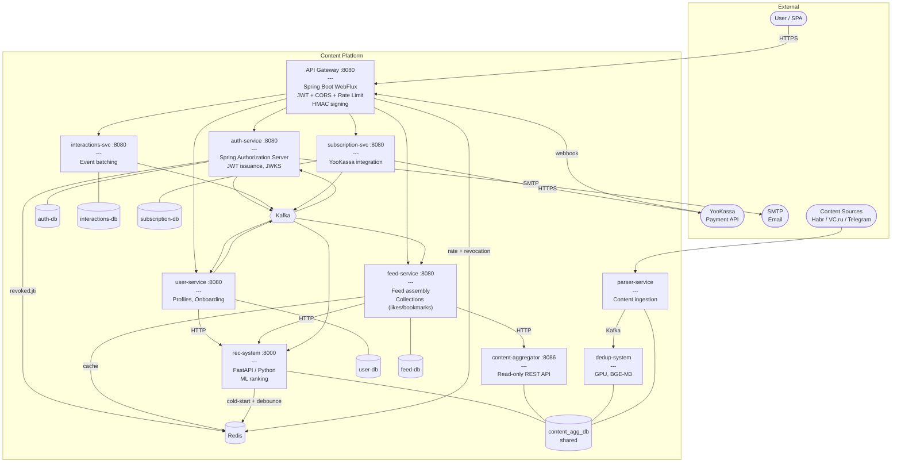

---

## 2. Registration + Email Verification + Onboarding

Полный путь нового пользователя от регистрации до первой персонализированной ленты.

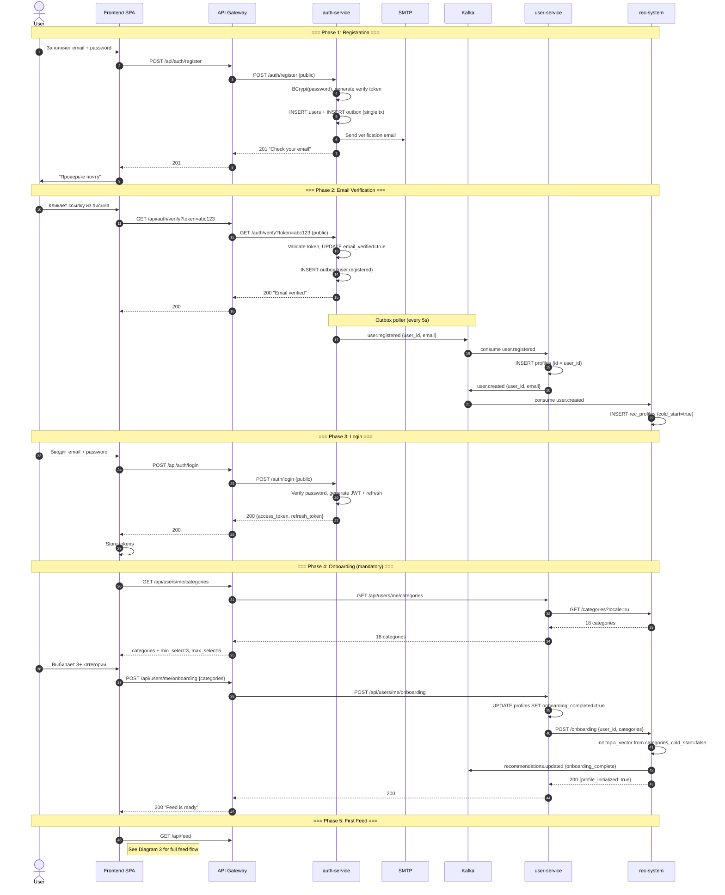

---

## 3. Feed Browsing (pagination, prefetch, refresh)

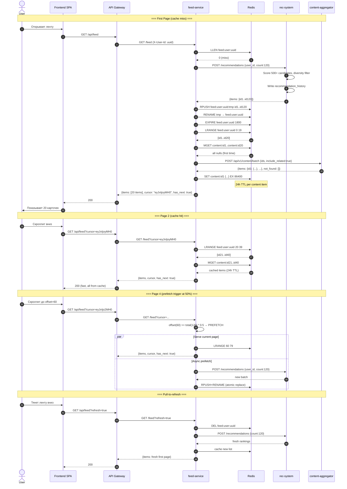

---

## 4. Content Detail + Related Content

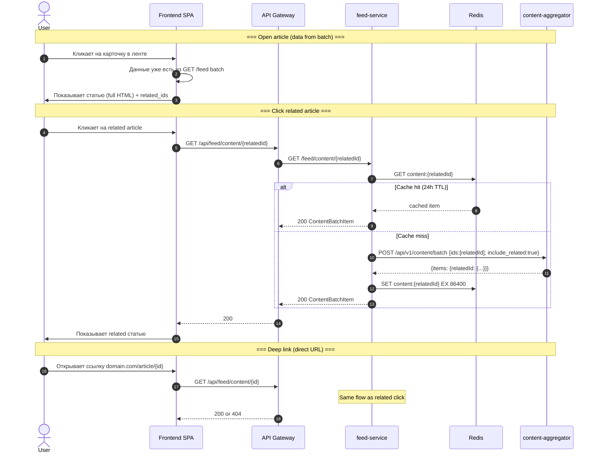

---

## 5. Like / Dislike / Bookmark

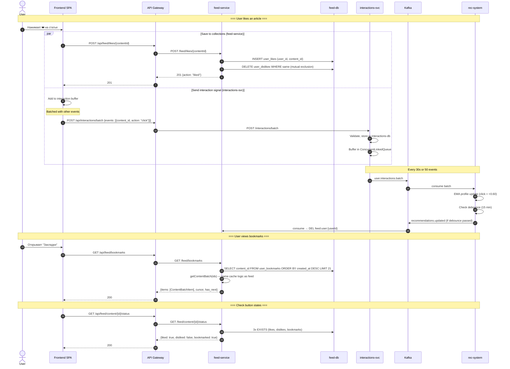

---

## 6. Subscription Purchase (YooKassa)

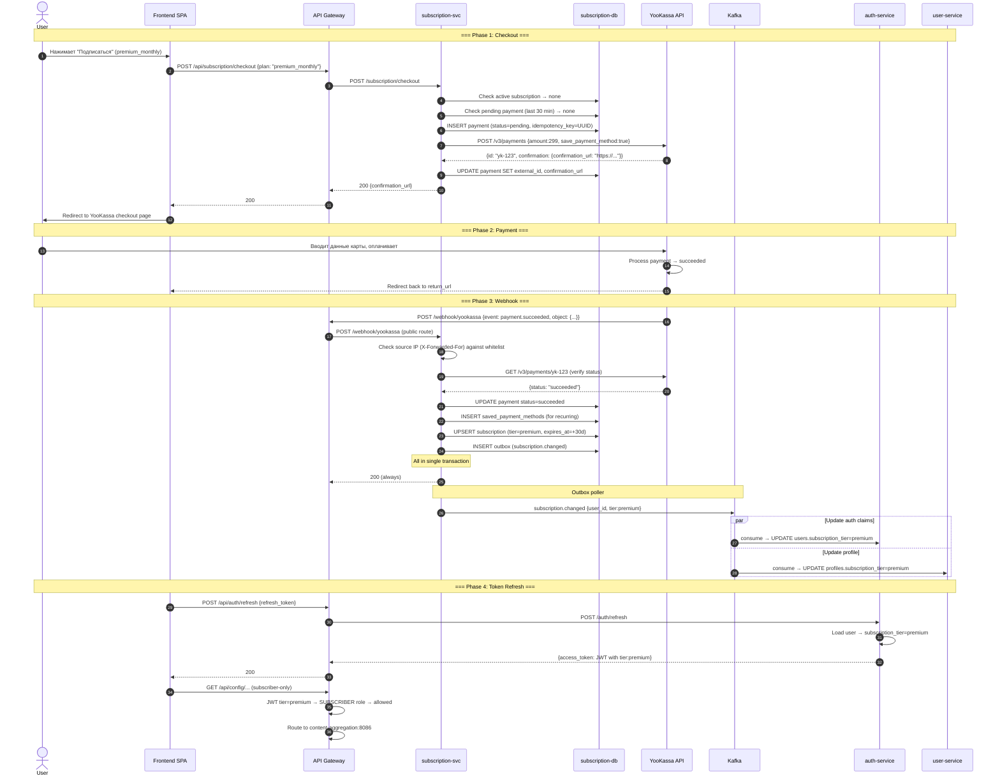

---

## 7. Auto-Renewal + Expiration

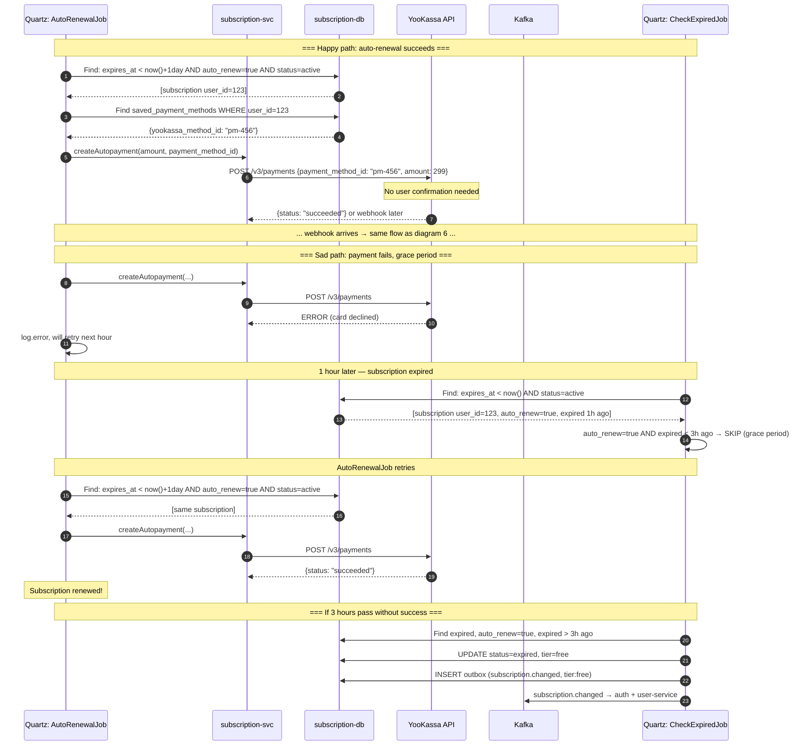

---

## 8. Logout + Token Revocation

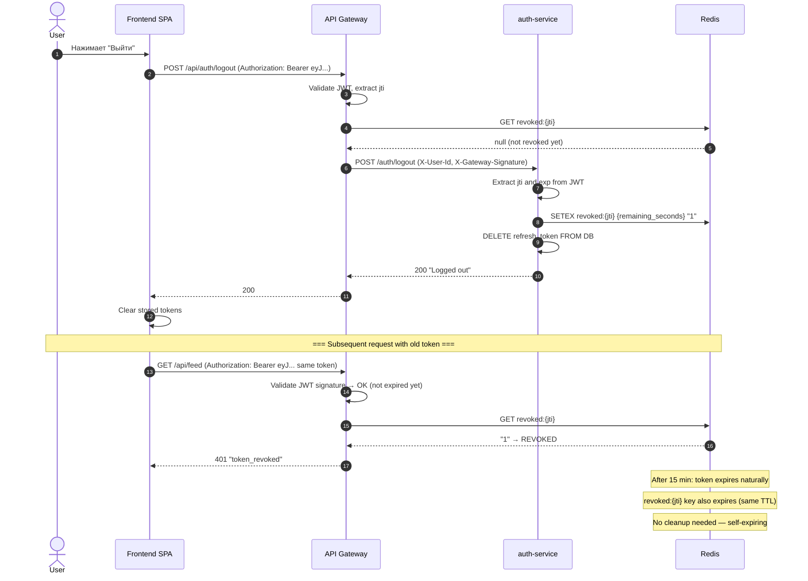

---

## 9. Kafka Event Flow Map

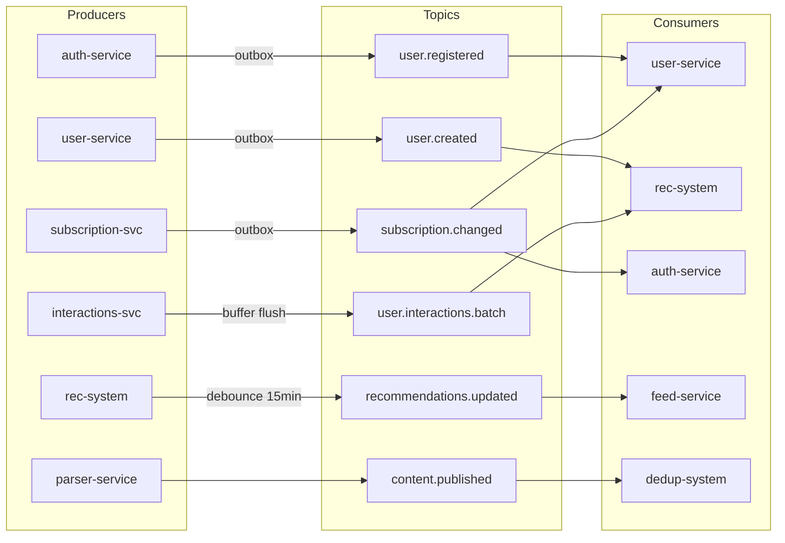

---

## 10. Redis Key Ownership Map

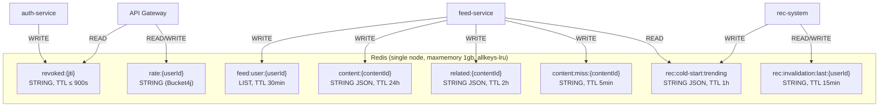

---

## 11. Database Ownership Map

```mermaid
graph TB
    subgraph Isolated["Isolated Databases (new services)"]
        AUTH_DB["auth-db\n---\nusers\nemail_verification_tokens\npassword_reset_tokens\nrefresh_tokens\noutbox"]
        USR_DB["user-db\n---\nprofiles\noutbox"]
        FEED_DB["feed-db\n---\nuser_bookmarks\nuser_likes\nuser_dislikes"]
        INT_DB["interactions-db\n---\nuser_interactions\n(partitioned monthly\n+ DEFAULT partition)"]
        SUB_DB["subscription-db\n---\nplans\nsubscriptions\npayments\nsaved_payment_methods\nwebhook_log\noutbox"]
    end

    subgraph Shared["Shared Database: content_agg_db (schema data_flow)"]
        T_RAW["raw_content\n(parser writes)"]
        T_PUB["published_content\n(parser writes)"]
        T_ART["articles\n(dedup writes)"]
        T_SIM["similarities\n(dedup writes)"]
        T_PF["posts_features\n(rec writes)"]
        T_RP["rec_profiles\n(rec writes)"]
        T_RH["recommendation_history\n(rec writes)"]
        T_CAT["categories\n(rec writes)"]
    end

    AUTH["auth-service"] --- AUTH_DB
    USR["user-service"] --- USR_DB
    FEED["feed-service"] --- FEED_DB
    INT["interactions-svc"] --- INT_DB
    SUB["subscription-svc"] --- SUB_DB

    REC["rec-system"] -->|read| T_RAW
    REC -->|read| T_ART
    REC -->|read| T_SIM
    REC -->|read| T_PUB
    REC -->|write| T_PF
    REC -->|write| T_RP
    REC -->|write| T_RH
    REC -->|write| T_CAT

    CAS["content-aggregator"] -->|read only| T_PUB
    CAS -->|read only| T_ART
    CAS -->|read only| T_SIM
```
