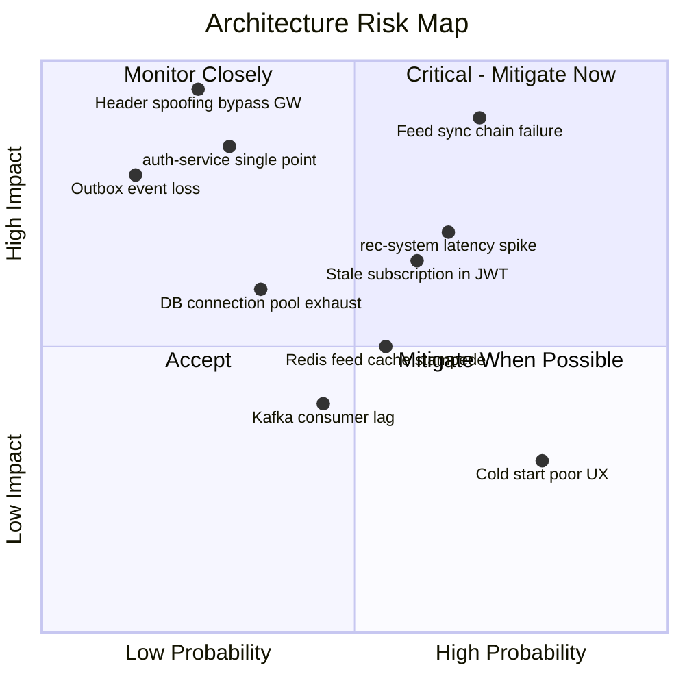

# Risk Assessment — Content Platform Architecture

**Date:** 2026-04-03  
**Methodology:** ATAM-lite (Architecture Trade-off Analysis Method)

## Risk Map



[View rendered diagram](https://l.mermaid.ai/lthqMW)

## Risk Register

| # | Risk | Probability | Impact | Priority | Mitigation |
|---|------|-------------|--------|----------|------------|
| R1 | **Feed synchronous chain failure** — feed-service → rec-system (HTTP) → content-service (HTTP). Any link down = feed unavailable | HIGH (0.70) | CRITICAL (0.90) | **P1** | Resilience4j circuit breaker on both calls. Fallback: stale Redis cache (serve last known feed). If cache also empty: trending content from `feed:cold-start:default` |
| R2 | **rec-system latency spike** — ML inference slow under load, model loading, GPU contention | HIGH (0.65) | HIGH (0.70) | **P1** | RestClient socket timeout 2s (connect + read). Circuit breaker (sliding-window=20, failure-rate=50%, wait=10s). Pre-compute feeds in background for active users |
| R3 | **Header spoofing bypass gateway** — Direct call to internal service with forged X-User-Id. CVE-2025-41235 demonstrated real exploitation | LOW (0.25) | CRITICAL (0.95) | **P2** | HMAC-SHA256 signature on forwarded headers. Docker network isolation (only gateway exposed). K8s NetworkPolicy restricting ingress to gateway pod only |
| R4 | **Stale subscription in JWT** — User paid but JWT still has `subscription_tier: free` | MEDIUM (0.60) | MEDIUM (0.65) | **P2** | Access token TTL 15 min. Frontend forces refresh after payment. Auth-service consumes `subscription.changed` with <3s Kafka lag. Practical delay: 1-5 sec |
| R5 | **auth-service single point of failure** — If down, no login/refresh possible. Existing JWTs continue to work (JWKS cached in gateway) | LOW (0.30) | CRITICAL (0.85) | **P2** | Run 2+ replicas. Health checks with auto-restart. JWKS cached in gateway — JWT validation works without auth-service |
| R6 | **Redis feed cache stampede** — Many users' cache expires simultaneously, all hit rec-system | MEDIUM (0.55) | MEDIUM (0.50) | **P3** | Distributed lock (SETNX) per user on cache rebuild. Jitter on TTL (25-35 min random). Stale-while-revalidate pattern |
| R7 | **Outbox event loss** — Poller crashes between Kafka send and marking as published → duplicate event | LOW (0.15) | HIGH (0.80) | **P3** | Idempotent consumers (ON CONFLICT DO NOTHING). DLQ for failed processing. Monitoring outbox lag (unpublished count). Phase 2: Debezium CDC with exactly-once semantics |
| R8 | **DB connection pool exhaustion** — Under burst traffic, HikariCP pool depleted | LOW (0.35) | HIGH (0.60) | **P3** | HikariCP: max-pool-size=20, connection-timeout=5s, leak-detection-threshold=30s. Monitor active/pending connections. Alert at 80% utilization |
| R9 | **Kafka consumer lag** — Consumer falls behind, stale data in downstream services | MEDIUM (0.45) | LOW (0.40) | **P4** | Consumer group monitoring (Burrow or Kafka built-in). Auto-scale consumers when lag > threshold. Alert on sustained lag > 5 minutes |
| R10 | **Cold start poor UX** — New user sees irrelevant content before onboarding completes | HIGH (0.80) | LOW (0.30) | **P4** | Global trending feed as default. Onboarding prompt for category selection → immediate rec-system call. Progressive improvement as interactions accumulate |

## Resilience4j Configuration (feed-service)

```yaml
resilience4j:
  circuitbreaker:
    instances:
      rec-system:
        sliding-window-size: 20
        failure-rate-threshold: 50
        wait-duration-in-open-state: 10s
        permitted-number-of-calls-in-half-open-state: 5
      content-service:
        sliding-window-size: 20
        failure-rate-threshold: 50
        wait-duration-in-open-state: 10s
  # NO timelimiter — feed-service uses blocking RestClient.
  # Socket-level timeouts (connect + read) handle thread release.
  # TimeLimiter only cancels CompletableFuture, not the blocked thread.
  retry:
    instances:
      content-service:
        max-attempts: 3
        wait-duration: 500ms
        exponential-backoff-multiplier: 2
```

**Decorator order:** CircuitBreaker → Retry → call (no TimeLimiter, no Bulkhead for MVP)  
**Timeouts:** RestClient connect=2s, read=2s for rec-system; connect=1s, read=1s for content-service.  
See `services/service-feed.md` section 8 for full configuration.

## Anti-Pattern Check

| Anti-Pattern | Status | Notes |
|-------------|--------|-------|
| Distributed monolith | **WARNING** | feed-service sync chain. Mitigated by circuit breakers + cache fallback |
| Shared database | **OK** | Database-per-service enforced |
| Missing circuit breaker | **MITIGATED** | Resilience4j on all sync HTTP calls |
| God service | **OK** | Clear responsibility boundaries |
| Kafka as request-reply | **OK** | Kafka used only for events (fire-and-forget) |
| Header trust without verification | **MITIGATED** | HMAC signature + network isolation |

---

**Краткое резюме (RU):** 10 идентифицированных рисков. Топ-2 критических: синхронная цепочка feed-сервиса (circuit breaker + cache fallback) и latency rec-system (RestClient socket timeout 2s + circuit breaker). Безопасность: HMAC подпись заголовков + сетевая изоляция. Все антипаттерны проверены, митигации описаны.
